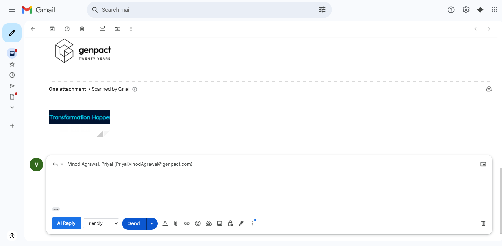
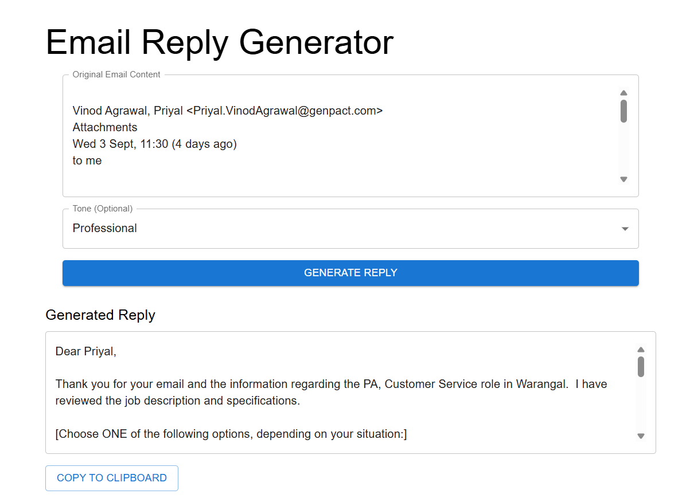

# 📧 AI Email Reply Generator

An **AI-powered Gmail assistant** that generates smart, context-aware replies with customizable tones like **Professional, Friendly, or Casual**.  
Use it directly in **Gmail via a Chrome Extension** or as a **standalone React web app** backed by a **Spring Boot API**.

---

## 🚀 Features

- ✨ **One-click AI replies** inside Gmail
- 🎭 **Multiple tones** (Professional, Friendly, Casual, etc.)
- 🌐 **React Web App** for standalone usage
- ⚙️ **Spring Boot Backend** to handle AI requests
- 🧩 **Chrome Extension** for Gmail integration
- 🔒 Simple & extensible architecture

---

## 🛠️ Tech Stack

- **Frontend**: React.js, TailwindCSS  
- **Backend**: Spring Boot (Java), REST API  
- **Extension**: JavaScript (Manifest V3, Content Scripts)  
- **AI**: OpenAI API (LLMs)  
- **Database (optional)**: MySQL / PostgreSQL  

---

## 📂 Project Structure

```bash
AI-Email-Reply-Generator/
│
├── emailWriterFrontEnd/   # React.js web application
├── emailWriterBackEnd/    # Spring Boot backend
├── email-writer-ext/      # Chrome extension for Gmail
└── README.md              # Project documentation
```

## ⚡ Getting Started

### 1️⃣ Clone the repo
```bash
git clone https://github.com/vivekram17/AI-Email-Reply-Generator.git
cd AI-Email-Reply-Generator
```
2️⃣ Start the Frontend
bash
Copy code
cd emailWriterFrontEnd
npm install
npm start
3️⃣ Start the Backend
bash
Copy code
cd emailWriterBackEnd
./mvnw spring-boot:run
4️⃣ Load the Chrome Extension
Open Chrome → go to chrome://extensions/

Enable Developer Mode

Click Load unpacked

Select the email-writer-ext folder

## 📸 Screenshots 

### Gmail compose box with AI Reply button


### Web app interface for generating replies


🏗️ Roadmap
 More tones (Empathetic, Formal, Concise)

 Multi-language support

 Outlook & Yahoo Mail integration

 Persistent user settings with database
